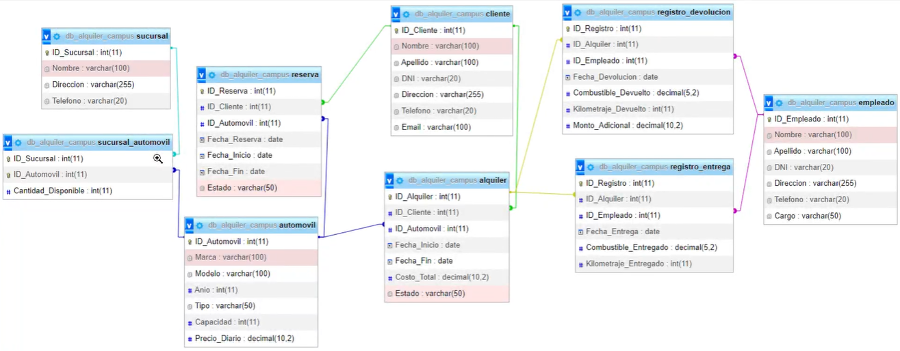

# mongoAlquiler
## Descripcion

se creo una base de datos con mongoDB sobre el funcionamiento de un alquiler y reserva de automoviles, con sus respectivas consultas. A continuación, se enumeran las colecciones creadas y los documentos insertados:

1. **sucursal:** Contiene información sobre diferentes sucursales, como su nombre, dirección y teléfono.
2. **automovil:** Almacena datos sobre los automóviles disponibles para alquiler, incluida su marca, modelo, año, tipo, capacidad y precio diario.
3. **sucursal_automovil:** Relaciona las sucursales con los automóviles disponibles en cada una, junto con la cantidad disponible de cada automóvil en la sucursal.
4. **cliente:** Contiene información sobre los clientes, incluidos su nombre, apellido, DNI, dirección, teléfono y correo electrónico.
5. **alquiler:** Registra los alquileres realizados por los clientes, con detalles como la fecha de inicio, fecha de finalización, costo total y estado del alquiler (activo o inactivo).
6. **reserva:** Almacena las reservas realizadas por los clientes, con detalles como la fecha de reserva, fecha de inicio, fecha de finalización y estado de la reserva (pendiente o confirmado).
7. **empleado:** Contiene información sobre los empleados, como su nombre, apellido, DNI, dirección, teléfono y cargo.
8. **registro_entrega:** Registra la entrega de un automóvil al cliente al finalizar un alquiler, incluida la fecha de entrega, cantidad de combustible entregado y kilometraje entregado.
9. **registro_devolucion:** Registra la devolución de un automóvil por parte del cliente al finalizar un alquiler, incluida la fecha de devolución, cantidad de combustible devuelto, kilometraje devuelto y monto adicional si corresponde.



## Requisitos previos

- Node.js instalado en tu máquina.

## Instalación

1. Clona este repositorio o descarga los archivos en tu máquina local.
2. Abre una terminal en el directorio raíz de la aplicación.
3. Ejecuta el siguiente comando para instalar las dependencias:

```
npm install
```

## Configuración

1. Crea una copia del archivo `.env.example`  con el nombre `.env` en el directorio raíz de la aplicación.
2. El archivo `.env` , viene con las iguientes varibales definidas:

```
MY_CONFIG={"hostname":"127.17.0.92", "port":5017}
MY_CONNECT= {"user": "cavillafrades", "password":"1005344957", "nameDB": "db_campus_alquiler"}
MY_JWT="villafrades"
```

De esa manera podremos acceder a la base de datos que hemos creado y sus registros por defectos.

3. Ahora corremos enla terminal el comando **npm run dev**.

4. Revisar que el "hostname" y el "port" no se encuentren en uso, en caso de generar algun error cambiar esos datos en el archivo `.env`.

   #### Ubicacion db

   - La creacion de nuestra base de datos e insercion de registros se ecuentran en la ruta **db/query.mongodb**
   - Nuestras consultas se encuentran en la ruta **db/consultas.mongodb**

### Importante antes de empezar

Antes de empezar a realizar las consultas debemosos generar un token de acceso para cada una de las collecciones. Este token debemos colocarlo en nuestro **header/Autorization**, este token tiene un limite de **30m** por colleccion, en ese rango de tiempo podremos acceder a las consultas de dicha colleccion.

- para generar nuestro token, debemos acceder a nuestra extencion de visual estudio llamada **Thunder-Client**, colocar la siguiente ruta:

  `GET: http://"hostname":"port"/token/"nombreColleccion"`

- Una vez generado el token de respectiva collecion podemos acceder a los Endpoints de esas colleccion 

## COLLECTIONS Y ENDPOINTS

### alquiler

- `http://"hostname":"port"/alquiler/` Listar todos los alquileres activos junto con los datos de los clientes relacionados.
- `http://"hostname":"port"/alquiler/detalles?id=""` Obtener los detalles del alquiler con el ID_Alquiler específico.
- `http://"hostname":"port"/alquiler/costoTotal?id=""` Obtener el costo total de un alquiler específico.
- `http://"hostname":"port"/alquiler/fechas/fecha_inicio=""` Obtener los detalles del alquiler que tiene fecha de inicio en '2023-07-05'.
- `http://"hostname":"port"/alquiler/cantidad` Cantidad total de alquileres registrados.

- `http://"hostname":"port"/alquiler/rango` Listar los alquileres con fecha de inicio entre '2023-07-05' y '2023-07-10'.

### automovil

- `http://"hostname":"port"/automovil/` Obtener todos los automóviles disponibles para alquiler
- `http://"hostname":"port"/automovil/capacidadMayor/"#personas"` Todos los automóviles con una capacidad mayor a X personas.
- `http://"hostname":"port"/automovil/ordenados` Automóviles ordenados por marca y modelo.
- `http://"hostname":"port"/automovil/sucursal` Cantidad total de automóviles en cada sucursal junto con su dirección
- `http://"hostname":"port"/automovil/disponibles?capacidad=""` Automóviles con capacidad igual a x personas y que estén disponibles.

### clientes

- `http://"hostname":"port"/clientes/` Mostrar todos los clientes registrados en la base de datos.
- `http://"hostname":"port"/clientes/especifico/dni=""` Clientes con el DNI específico.
- `http://"hostname":"port"/clientes/alquiler` Clientes que realizaron al menos un alquiler.

### empleado

- `http://"hostname":"port"/empleado/` Listar los empleados con el cargo de "Vendedor".
- `http://"hostname":"port"/empleado/cargoEspecial` Listar los empleados con cargo de "Gerente" o "Asistente"

### reserva

- `http://"hostname":"port"/reserva/` Reserva pendientes.
- `http://"hostname":"port"/reserva/pendiente?id_cliente=""` Reservas pendientes realizadas por un cliente especifico

### sucursal

- `http://"hostname":"port"/sucursal` Cantidad total de automóviles disponibles en cada sucursal

## Contacto

Nombre: Carlos Villafrades Pinilla

Email: [cavillafrades@gmail.com](mailto:cavillafrades@gmail.com)